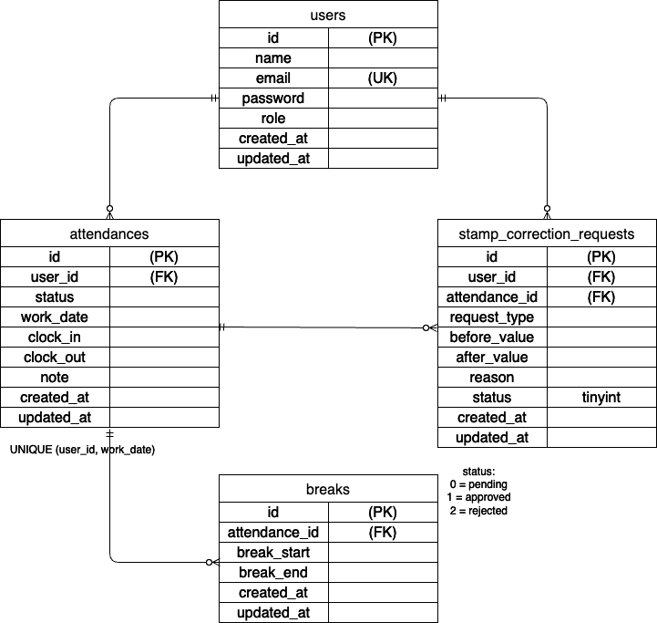

# COACHTECH 勤怠管理アプリ

## 概要

本アプリケーションは、スタッフの出勤・退勤・休憩管理および
管理者による勤怠確認・修正申請承認を行うための勤怠管理システムです。

---

## 環境構築

```bash
git clone <リポジトリURL>
cd coachtech-kintai-app
docker-compose up -d --build
docker-compose exec php bash
composer install
cp .env.example .env
php artisan key:generate
php artisan migrate --seed

```

---

## 使用技術

### バックエンド

* PHP 8.2
* Laravel 12.x

### フロントエンド

* Blade
* HTML / CSS

### データベース

* MySQL 8.0

### 開発環境

* Docker

  * nginx
  * php
  * mysql

### テスト

* PHPUnit 11.5

### その他

* Git / GitHub

---

## ER図

本アプリケーションのER図は以下に掲載しています。



---

## URL

* 開発環境：http://localhost
* phpMyAdmin：http://localhost:8081

---

## 主な機能

### スタッフ側

* 出勤 / 退勤 / 休憩打刻
* 勤怠一覧表示（月別）
* 勤怠詳細確認
* 打刻修正申請
* 申請状況確認（承認待ち / 承認済み）

### 管理者側

* 全ユーザー勤怠一覧表示
* ユーザー別勤怠確認
* 勤怠詳細編集
* 打刻修正申請の承認 / 却下
* CSV出力

---

## テスト

* Featureテスト・Unitテストを実装
* **全テスト成功（69 tests / 120 assertions）**

```bash
php artisan test
```

---

## 今後の改善点（任意）

* UI/UXの改善
* 本番環境へのデプロイ
* CSV出力機能の拡張
* バリデーション強化

---

## 作成者

* 本間　雄一
